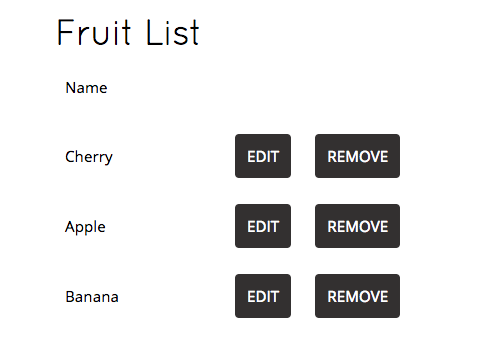

# Create REST services for the fruit web application

**1. Add a service**

First, we need to create the java class file. For that, you need to execute the following command ``touch src/main/java/com/example/service/FruitController.java``{{execute}}

Secondly, open ``src/main/java/com/example/service/FruitController.java``{{open}}

Finally, copy the below content into the file (or use the `Copy to editor` button):

<pre class="file" data-filename="src/main/java/com/example/service/FruitController.java" data-target="replace">
package com.example.service;

import java.util.List;
import java.util.Objects;
import java.util.Spliterator;
import java.util.stream.Collectors;
import java.util.stream.StreamSupport;

import org.springframework.beans.factory.annotation.Autowired;
import org.springframework.http.HttpStatus;
import org.springframework.http.MediaType;
import org.springframework.stereotype.Controller;
import org.springframework.web.bind.annotation.DeleteMapping;
import org.springframework.web.bind.annotation.GetMapping;
import org.springframework.web.bind.annotation.PathVariable;
import org.springframework.web.bind.annotation.PostMapping;
import org.springframework.web.bind.annotation.PutMapping;
import org.springframework.web.bind.annotation.RequestBody;
import org.springframework.web.bind.annotation.RequestMapping;
import org.springframework.web.bind.annotation.ResponseBody;
import org.springframework.web.bind.annotation.ResponseStatus;

@Controller
@RequestMapping(value = "/api/fruits")
public class FruitController {

    private final FruitRepository repository;

    @Autowired
    public FruitController(FruitRepository repository) {
        this.repository = repository;
    }

    @ResponseBody
    @GetMapping(produces = MediaType.APPLICATION_JSON_VALUE)
    public List<Fruit> getAll() {
        return StreamSupport
                .stream(repository.findAll().spliterator(), false)
                .collect(Collectors.toList());
    }

//TODO: Add additional service calls here
}
</pre>

Take a minute and review the `FruitController`. At this stage is pretty simple and only has one method that exposes an endpoint for HTTP GET request for path `/api/fruits`, as specified in the class annotation `@RequestMapping(value = "/api/fruits")`. We should now be able to see a list of fruits on the web page.

**2. Test the service from a web browser locally**

Run the application by executing the below command:

``mvn spring-boot:run -DskipTests``{{execute}}

>**NOTE:** We skip the tests to speed up the start and since we do not have any tests for the REST service. Please note that the `spring-boot-crud-booster` [here](https://github.com/snowdrop/spring-boot-crud-booster) has test cases for REST, please review them if interested. 

In the interest of time, we will skip creating test cases for the service and instead test it directly in our web browser.

When the console reports that Spring is up and running access the web page by either click the Web Browser Tab or use [this](https://[[HOST_SUBDOMAIN]]-8080-[[KATACODA_HOST]].environments.katacoda.com/) link.

If everything works the web page should look something like this:

Press **CTRL+C** to stop the application.

**3. Create additional service for update, create and delete**

Add the following methods to the Fruit Controller at the TODO marker.

<pre class="file" data-filename="src/main/java/com/example/service/FruitController.java" data-target="insert" data-marker="//TODO: Add additional service calls here">
    @ResponseBody
    @ResponseStatus(HttpStatus.CREATED)
    @PostMapping(consumes = MediaType.APPLICATION_JSON_VALUE, produces = MediaType.APPLICATION_JSON_VALUE)
    public Fruit post(@RequestBody(required = false) Fruit fruit) {
        verifyCorrectPayload(fruit);

        return repository.save(fruit);
    }

    @ResponseBody
    @GetMapping(value = "/{id}", produces = MediaType.APPLICATION_JSON_VALUE)
    public Fruit get(@PathVariable("id") Integer id) {
        verifyFruitExists(id);

        return repository.findOne(id);
    }

    @ResponseBody
    @ResponseStatus(HttpStatus.OK)
    @PutMapping(value = "/{id}", consumes = MediaType.APPLICATION_JSON_VALUE, produces = MediaType.APPLICATION_JSON_VALUE)
    public Fruit put(@PathVariable("id") Integer id, @RequestBody(required = false) Fruit fruit) {
        verifyFruitExists(id);
        verifyCorrectPayload(fruit);

        fruit.setId(id);
        return repository.save(fruit);
    }

    @ResponseStatus(HttpStatus.NO_CONTENT)
    @DeleteMapping("/{id}")
    public void delete(@PathVariable("id") Integer id) {
        verifyFruitExists(id);

        repository.delete(id);
    }

    private void verifyFruitExists(Integer id) {
        if (!repository.exists(id)) {
            throw new RuntimeException(String.format("Fruit with id=%d was not found", id));
        }
    }

    private void verifyCorrectPayload(Fruit fruit) {
        if (Objects.isNull(fruit)) {
            throw new RuntimeException("Fruit cannot be null");
        }

        if (!Objects.isNull(fruit.getId())) {
            throw new RuntimeException("Id field must be generated");
        }
    }
</pre>

**5. Run and verify**

Build and start the application again

``mvn spring-boot:run -DskipTests``{{execute}}

Now that we have implemented all the services we are now able to see fruits on the page, and also update, create and delete them.

When the console reports that Spring is up and running access the web page by either click the Web Browser Tab or use [this](https://[[HOST_SUBDOMAIN]]-8080-[[KATACODA_HOST]].environments.katacoda.com/) link.

## Congratulations

You have now learned how to how to create REST Services that access a database. 

In next step of this scenario, you will learn how to access and login to your openshift environment. 