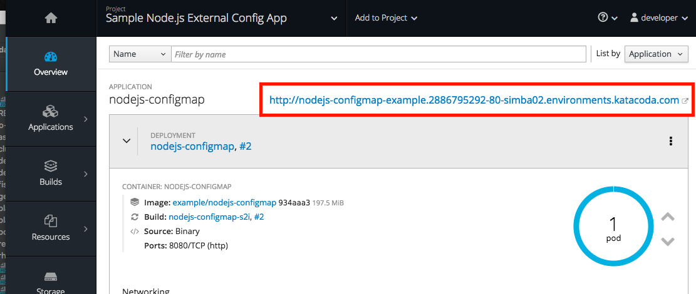

Now that you've logged into OpenShift, let's deploy the same sample application as before.

**1. Build and Deploy**

Build and deploy the project using the following command:

```npm run openshift```{{execute}}

This uses NPM and the [Nodeshift](https://github.com/bucharest-gold/nodeshift) project to build and deploy the sample
application to OpenShift using the containerized Node.js runtime. Nodeshift uses the files in the `.nodeshift`
directory of the sample project to create the necessary Kubernetes objects to cause the application to be deployed.

The build and deploy may take a minute or two. Wait for it to complete. You should see `INFO done` at the end of the build output, and you
should not see any obvious errors or failures.

After the build finishes it will take less than a minute for the application to become available.
To verify that everything is started, run the following command and wait for it report
`replication controller "nodejs-configmap-1" successfully rolled out`

``oc rollout status dc/nodejs-configmap``{{execute}}

** 2. Access the application running on OpenShift**

This sample project includes a simple UI that allows you to access the Greeting API. Click the
[route URL](http://nodejs-configmap-example.[[HOST_SUBDOMAIN]]-80-[[KATACODA_HOST]].environments.katacoda.com) to open up the sample application in a separate browser tab:

> You can also access the application through the link on the OpenShift Web Console Overview page. 

Enter a name in the 'Name' field and click **Invoke** to test out the service. You should get the same hard-coded
greeting as in previous steps.


While the greeting code is functional, if you wanted to change the message you would need to stop the
application, make the code change, and re-deploy. As you'll learn in the next section, in a real world
application this may not be feasible and a mechanism to dynamically change the content is needed.
You will add this using OpenShift _ConfigMaps_.